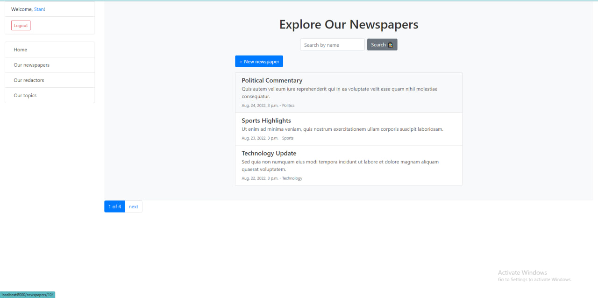

# Print Phrase

Django project for managing redactors and newspapers in newspaper agency

## Check it out!
[PrintPhrase project deployed to Render](https://print-phrase1.onrender.com/)

## Installation

Python3 and Django must be already installed


```shell
git clone https://github.com/Dobryk12/print-phrase.git
python3 -m venv venv
source venv/bin/activate
python manage.py makemigrations
python manage.py migrate
python manage.py runserver
```

## Features 

* You can create superuser by your own, or use which is already exist:
Login: Stan
Password: stan12345
* Also you can download data from print_phrase_db_data.json, by using command:
```python manage.py loaddata print_phrase_db_data.json```

* Login: Stan
* password: stan12345



